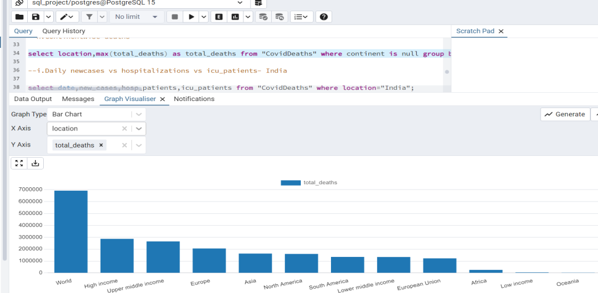
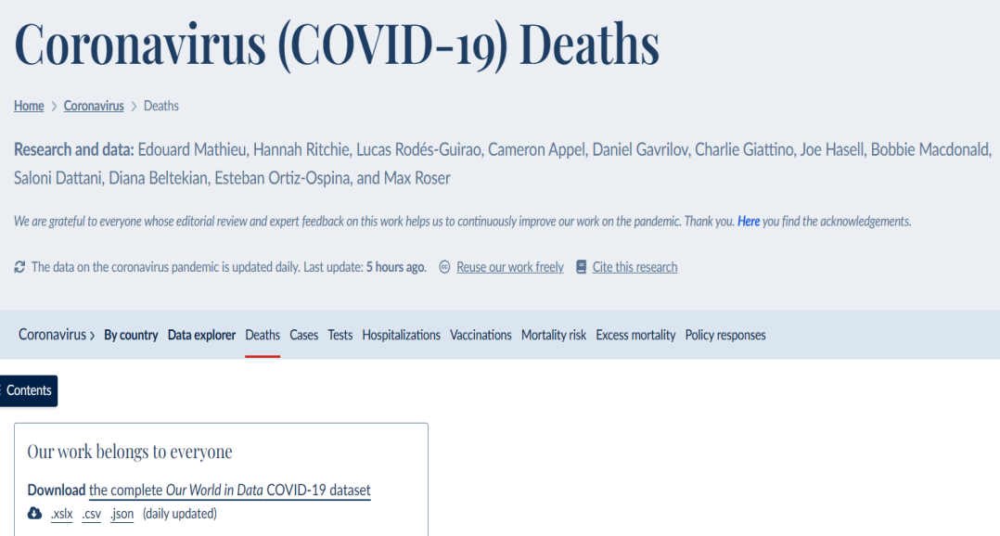
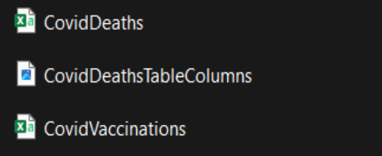
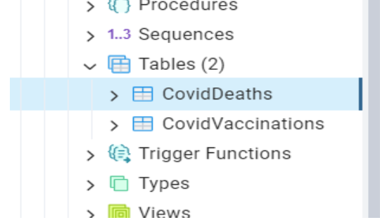
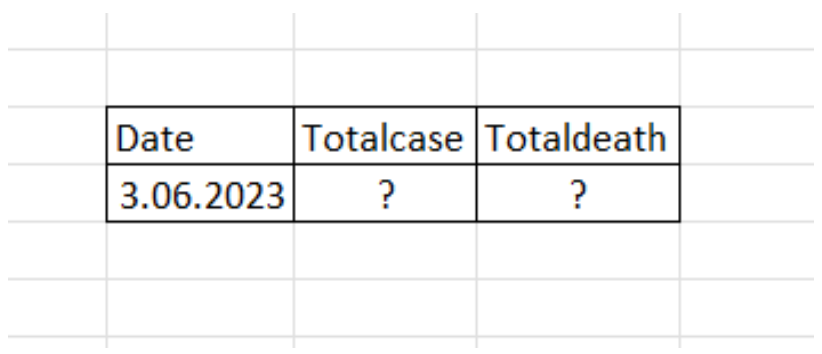

## Coronavirus (COVID-19) Deaths

The aim of this project is to make data discovery by asking various questions on a data set about Coronavirus (COVID-19) Deaths. We will use PostgreSQL while doing this discovery.This data set contains data from many countries. We will perform our queries through India, one of the countries most affected by Covid 19. The reason we do this is to easily access a lot of data with our queries.

When starting the project, you can download the data set from the specified link. We have grouped the sections that will be useful to us from this data set into 2 different .csv files. You can access these from the files of our project.

Download the Coviddeaths daily data (csv dataset) from (https://ourworldindata.org/covid-deaths).

In general, I will try to present the steps clearly enough by stating the steps we will do in the project and the questions we will answer one by one

1-Seperate the data into 2 .csv files as CovidDeaths and CovidVaccinations.

2-In PostgreSQL create 'sql_project' DB.

3-Create 2 tables alomg with column and its datatype by refering the csv files.

 

4-Import the data from corresponding csv file(You can access the column names and data types of the tables you will create from the photos in the project file).

5-Explore the data to get answer for questions

    a.Datewise Likelihood of dying due to Covid-Totalcases vs TotalDeath- in India.

    So we will look for a table that shows the data like this:

    b.Total %of deaths out of entire population- in India.

    c.Verify b by getting info separately.

    d.Country with highest death as a % of population.

    e.Total % of of covid +ve cases- in India.

    f.Total % of covid +ve cases- in World.

    g.Continentwise +ve cases.
    
    h.Continentwise deaths.

## Website

For more information about the project, visit my website (https://www.sametyolcu.com/portfolio).